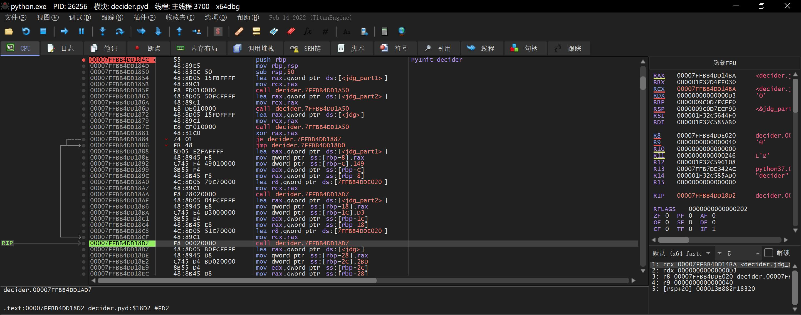
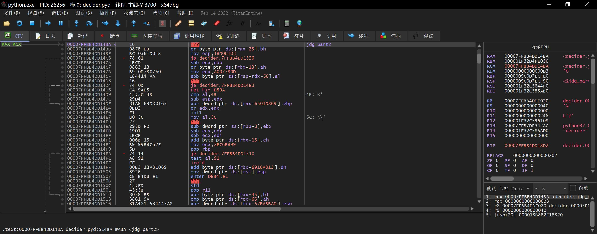
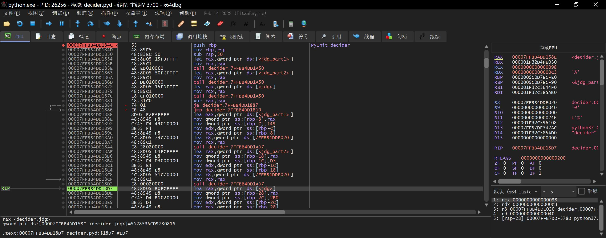
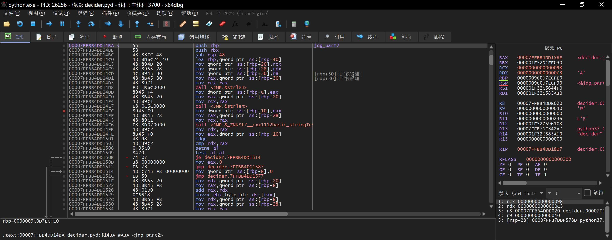

[TOC]


# 直接用g++和cmake编译出pyd文件，及实战出一道Python调用pyd+二进制逆向tricks的CTF题

## 引言

在[我前些天产出的blog](https://www.52pojie.cn/thread-1923720-1-1.html)里介绍了如何用`setuptools`编译出pyd文件并调用之。于是我进一步地希望能够直接用g++和`cmake`编译出pyd文件，因为做到这件事以后能做的事太多了，比如下文实战案例将要展示的，引入一些二进制逆向tricks。无奈网上几乎没有这方面的资料，于是有了这篇~~精华~~水blog。

[本文项目GitHub传送门](https://github.com/Hans774882968/pyd-smc-ctf-challenge)

**作者：[hans774882968](https://blog.csdn.net/hans774882968)以及[hans774882968](https://juejin.cn/user/1464964842528888)以及[hans774882968](https://www.52pojie.cn/home.php?mod=space&uid=1906177)**

## 环境

- Windows10 VSCode
- Python 3.7.6 pytest 7.4.4 setuptools 68.0.0
- `g++.exe (x86_64-win32-seh-rev1, Built by MinGW-Builds project) 13.1.0` from [here](https://whitgit.whitworth.edu/tutorials/installing_mingw_64)
- cmake 3.27.0

## 如何直接用g++和cmake编译出pyd文件

因为网上几乎没有这方面的资料，所以需要自己找突破口，最后我选择从`setuptools`所做的事入手。在[我前些天产出的blog](https://www.52pojie.cn/thread-1923720-1-1.html)的项目里，尝试`python setup.py build_ext --inplace`命令会发现它输出了编译过程的所有命令。比如：

```
running build_ext
building 'pyd_demo.first_pyd_demo' extension
creating build
creating build\temp.win-amd64-cpython-37
creating build\temp.win-amd64-cpython-37\Release
creating build\temp.win-amd64-cpython-37\Release\pyd_demo
gcc -mdll -O -Wall -IC:\python\include -IC:\python\Include -c pyd_demo/hello.cpp -o build\temp.win-amd64-cpython-37\Release\pyd_demo\hello.o
writing build\temp.win-amd64-cpython-37\Release\pyd_demo\first_pyd_demo.cp37-win_amd64.def
creating build\lib.win-amd64-cpython-37
creating build\lib.win-amd64-cpython-37\pyd_demo
g++ -O -Wall -shared -s build\temp.win-amd64-cpython-37\Release\pyd_demo\hello.o build\temp.win-amd64-cpython-37\Release\pyd_demo\first_pyd_demo.cp37-win_amd64.def -LC:\python\libs -LC:\python -LC:\python\PCbuild\amd64 -lpython37 -lvcruntime140 -o build\lib.win-amd64-cpython-37\pyd_demo\first_pyd_demo.cp37-win_amd64.pyd
copying build\lib.win-amd64-cpython-37\pyd_demo\first_pyd_demo.cp37-win_amd64.pyd -> pyd_demo
```

如果尝试自己用g++编译出pyd，一般都会碰到的错误：

```
// ...
<mingw64-v13 dir>/bin/../lib/gcc/x86_64-w64-mingw32/13.1.0/../../../../x86_64-w64-mingw32/bin/ld.exe: first_pyd_demo.cpp:21: undefined reference to `__imp_PyDict_SetItemString'
<mingw64-v13 dir>/bin/../lib/gcc/x86_64-w64-mingw32/13.1.0/../../../../x86_64-w64-mingw32/bin/ld.exe: <%homepath%>\AppData\Local\Temp\ccxWS8pN.o: in function `PyInit_first_pyd_demo':
first_pyd_demo.cpp:38: undefined reference 
to `__imp_PyModule_Create2'
collect2.exe: error: ld returned 1 exit status
```

搜索引擎搜不到这个报错的解决方案。但观察`setuptools`输出的编译命令可知从失败到成功最关键的是`<python install dir>\libs\python37.lib`。由此我们得到只使用g++就能编译出pyd的命令：

```bash
g++ first_pyd_demo.cpp -g -shared -o first_pyd_demo.pyd -L<python install dir>\libs -I<python install dir>\include -lpython37
```

[参考链接1 -L等参数的意义](https://www.cnblogs.com/zhangkele/p/10043207.html)

由此可进一步推出可行的cmake配置如下：

```cmake
cmake_minimum_required(VERSION 3.0.0)
project(compile-pyd-cmake VERSION 0.1.0 LANGUAGES C CXX)

include(CTest)
enable_testing()

add_library(compile-pyd-cmake SHARED compile-pyd-cmake.cpp)

set(PYTHON37_LIB C:/python/libs)
include_directories(C:/python/include)
target_link_libraries(compile-pyd-cmake ${PYTHON37_LIB}/python37.lib)

set(CPACK_PROJECT_NAME ${PROJECT_NAME})
set(CPACK_PROJECT_VERSION ${PROJECT_VERSION})
include(CPack)
```

## 实战：出一道Python调用pyd+二进制逆向tricks的CTF题

涉及的二进制逆向tricks：

- SMC。[我写的入门题题解](https://www.52pojie.cn/thread-1667202-1-1.html)、[手把手带你基于dll实现多次SMC](https://www.52pojie.cn/thread-1780843-1-1.html)
- 花指令。[通俗易懂的gcc内联汇编入门+示例：实现花指令](https://www.52pojie.cn/thread-1695068-1-1.html)

TODO

## 如何调试：用x64dbg

在VSCode给python文件打断点，并进行调试。在命中断点时，打开x64dbg，左上角导航栏“文件->附加”选择要附加的进程。在弹出的小窗口的搜索栏输入python，一般会有好几个结果，所以你需要一个一个看是不是我们要调试的进程。怎么看？点击上方的“符号”标签页，能搜到用户模块`decider.pyd`的唯一进程就是所求。我的实操经验是，出现在最上方的进程即所求。找到相关的方法后用x64dbg正常调试即可。

### 如何查看SMC解密的效果

假设你要查看`decider.pyd`运行`PyInit_decider`时的解密效果。首先在VSCode给import那行打断点：

```python
from decider import jdg
```

接着和上文一样开启VSCode调试，以及用x64dbg附加进程。附加后可以看到运行点处于`prepare.pyd`。先点一次VSCode的Step Over按钮，然后点击若干次x64dbg的运行按钮，才会来到`decider.pyd`的`__dyn_tls_init`。此时在`PyInit_decider`处打断点，再点一两次运行按钮就能来到`PyInit_decider`处了。

以`jdg_part2`为例，展示下SMC解密效果。解密前运行点：



解密前`jdg_part2`：



解密后运行点：



解密后`jdg_part2`：



## 用pyinstaller打包为exe

TODO

## 参考资料

1. https://www.cnblogs.com/zhangkele/p/10043207.html